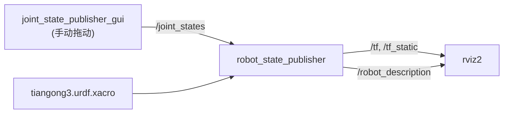
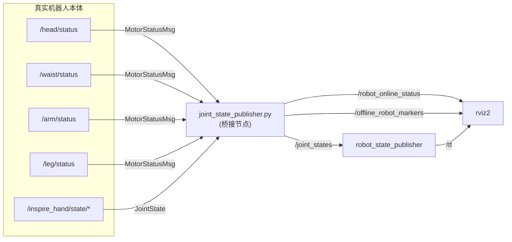
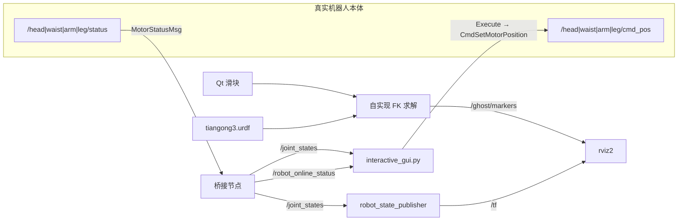

# 系统架构

本文档说明本仓库的软件组成、数据流与关键设计决策。

## 目录

- [1. 总体结构](#1-总体结构)
- [2. 运行时数据流](#2-运行时数据流)
- [3. 节点职责](#3-节点职责)
- [4. 关节状态桥接设计](#4-关节状态桥接设计)
- [5. Ghost Robot 设计](#5-ghost-robot-设计)
- [6. 离线检测设计](#6-离线检测设计)
- [7. 交互控制的线程模型](#7-交互控制的线程模型)
- [8. 坐标系与 TF 树](#8-坐标系与-tf-树)
- [9. 扩展点](#9-扩展点)

---

## 1. 总体结构

本仓库是标准 ROS 2 colcon 工作空间，只有两个包，职责清晰分离：

```text
                        ┌──────────────────────────────────────────────┐
                        │            bodyctrl_msgs (接口包)             │
                        │  42 个 .msg  +  22 个 .srv                   │
                        │  MotorStatusMsg / CmdSetMotorPosition / ...  │
                        └───────────────────┬──────────────────────────┘
                                            │ 依赖（消息类型）
                        ┌───────────────────▼──────────────────────────┐
                        │         tiangong3_urdf (功能包)            │
                        │  ┌────────────┐  ┌──────────┐  ┌───────────┐ │
                        │  │ urdf/      │  │ launch/  │  │ scripts/  │ │
                        │  │ meshes/    │  │ config/  │  │  (Python) │ │
                        │  └────────────┘  └──────────┘  └───────────┘ │
                        └──────────────────────────────────────────────┘
```

- **接口包与实现包分离**：`bodyctrl_msgs` 描述机器人本体通信协议，
  其他项目（如 `ros_pro_tf` 等）也可将其作为依赖复用；
- **数据包（无 C++ 编译产物）**：`tiangong3_urdf` 的 `CMakeLists.txt`
  只做 `install(DIRECTORY ...)`，不含 C++ 源码，编译极快；
- **Python 节点以 `PROGRAMS` 安装**，通过 `ros2 run <pkg> <script>.py` 启动。

## 2. 运行时数据流

### 2.1 离线模式（`display.launch.py`）



不接触机器人，用于核对模型与关节方向。

### 2.2 状态回显模式（`display_with_status.launch.py`）



**只读**：桥接节点只订阅、不发布任何控制指令。

### 2.3 交互控制模式（`interactive_control.launch.py`）



关键点：**Ghost 预览（拖动）与真机执行（Execute）完全解耦**，
拖动滑块只更新 Marker，不产生任何下发。

## 3. 节点职责

| 节点 | 所在文件 | 职责 |
|------|----------|------|
| `robot_state_publisher` | 官方包 | 由 `/joint_states` + `robot_description` 计算并广播 TF |
| `joint_state_publisher_gui` | 官方包 | 离线模式下用 GUI 生成 `/joint_states` |
| `tg_joint_state_publisher` / `real_status_bridge` | `scripts/joint_state_publisher.py` | 聚合真机状态 → `/joint_states`；连接状态；离线覆盖网格 |
| `interactive_gui` | `scripts/interactive_gui.py` | Qt 控制面板；Ghost 预览；指令下发；安全确认 |
| `rviz2` | 官方包 | 可视化 TF、机器人模型、MarkerArray |

> 同一个脚本 `joint_state_publisher.py` 在两个 launch 中使用不同的节点名
> （`tg_joint_state_publisher` / `real_status_bridge`），便于在 `ros2 node list` 中区分。

## 4. 关节状态桥接设计

### 4.1 为什么需要桥接

机器人本体不直接发布 `sensor_msgs/JointState`，而是按部位发布
`MotorStatusMsg`（含电机 ID、位置、速度、电流、温度、错误码）。
而 `robot_state_publisher` 只接受标准 `JointState`（并要求关节名与 URDF 一致）。
桥接节点的作用就是把 **「电机 ID 语义」翻译成「URDF 关节名语义」**。

### 4.2 处理流程

```text
MotorStatusMsg.status[]
        │
        ├─ status.name (uint16 电机 ID)──┐
        └─ status.pos  (float32, rad)   │
                                        ▼
                        MOTOR_ID_TO_JOINT[电机 ID] → 关节名
                                        │
                                        ▼
                        self.joint_positions[关节名] = pos   (覆盖式更新)
                                        │
                        20 Hz 定时器 ──►│
                                        ▼
                        JointState{ name: [...], position: [...] } → /joint_states
```

设计要点：

| 要点 | 说明 |
|------|------|
| **覆盖式更新** | 每次收到消息只更新出现的电机，其余保持上次值，避免不同部位到达频率不一致导致关节跳变 |
| **固定 20 Hz 发布** | 定时器周期 `0.02 s`，与上位机话题频率解耦，保证 TF 平滑 |
| **零位初始化** | 未收到数据前所有关节为 `0.0`，机器人显示为默认站姿 |
| **手部线性映射** | 手部状态为归一化值（0–1，`1.0` = 完全张开），按 `rad = (1 - value) * limit` 转换为弧度，`limit` 取自 `LEFT/RIGHT_HAND_JOINTS`。⚠️ 该映射结果会作为**未知关节名**进入 `/joint_states`（URDF 无手部 link），`robot_state_publisher` 会忽略它们 |
| **无状态回写** | 桥接节点不缓存时间戳，仅用 `time.time()` 记录最近一次数据到达时刻 |

### 4.3 时序约束

| 参数 | 值 | 位置 |
|------|----|------|
| 发布周期 | 20 Hz | `create_timer(0.02, ...)` |
| 在线判定超时 | 1.0 s | `is_online = (now - last_data_time) < 1.0` |
| 订阅队列 | 10 | 各 `create_subscription` |

> 超时阈值与发布周期目前**硬编码**，如需调整需改源码；
> 计划提取为 ROS 参数（见 [`CHANGELOG.md`](../CHANGELOG.md#计划中)）。

## 5. Ghost Robot 设计

**目标**：拖动滑块时立即看到"目标姿态"，但不能污染真实 TF 树
（否则 `robot_state_publisher` 与 Ghost 会争抢同一 link 的变换）。

**方案**：Ghost **不发布 TF，也不发布 `/joint_states`**，
而是用 `visualization_msgs/MarkerArray` 在 `/ghost/markers` 上绘制一组
`MESH_RESOURCE` 标记，每个 link 一个 marker，
`header.frame_id` 统一设为根坐标系 `pelvis`，位姿由**自实现的前向运动学**算出。

### 5.1 自实现 FK 流程

```text
1. 启动时解析 URDF
   ├─ joints[name]  = {parent, child, origin_xyz, origin_rpy, axis, type}
   ├─ child_to_parent[child] = (parent, joint_name)
   └─ links[name]   = [(mesh_path, visual_xyz, visual_rpy), ...]   # visual 的相对位姿

2. 每次滑块变化时：
   对每个 link 递归求 T_link_global (根 pelvis = 单位阵)
        T = T_parent_global @ T_origin(joint) @ T_joint(theta, axis)
   其中 T_joint 用 Rodrigues 公式：R = I + sinθ·K + (1-cosθ)·K²

3. 对每个 visual：
   T_final = T_link_global @ T_visual
   → 写入 marker.pose（位置 + 由旋转矩阵转四元数）

4. 发布 MarkerArray（青色，RGBA = 0,1,1,0.6，scale = 1.0）
```

### 5.2 设计权衡

| 选择 | 理由 | 代价 |
|------|------|------|
| 自实现 FK 而非 KDL / `tf2` | 避免额外依赖，且 marker 需要一次性算出全机位姿 | 不支持 mimic / 多自由度关节类型（当前模型用不到） |
| Marker 而非 `robot_state_publisher` 二次实例 | 不会与真实 TF 冲突 | Marker 不参与碰撞检测，仅可视化 |
| 根坐标系 `pelvis` | 与 RViz `Fixed Frame` 一致 | 若改成 `world` 需同步改 RViz 配置 |
| 每次全量重发 MarkerArray | 实现简单，无需 diff | 39 个 link 全量发布，10 Hz 下开销可接受 |

## 6. 离线检测设计

| 阶段 | 行为 |
|------|------|
| 数据到达 | `motor_status_callback` / 手部回调刷新 `last_data_time` |
| 每秒检查 | `publish_joint_states` 中 `is_online` 判定并发布 `/robot_online_status` |
| 在线 | 向 `/offline_robot_markers` 发布带 `DELETEALL` 的 MarkerArray，清除红色覆盖 |
| 离线 | 解析 URDF 得到的 visual 列表逐个转成红色（`1,0,0,1`）mesh marker，`scale = 1.05`（略微外扩避免 Z-fighting），发布到各 link 坐标系 |
| GUI 侧 | 订阅 `/robot_online_status`，更新窗口标题并启用/禁用 `Sync to Real`、`Execute` |

> ⚠️ 这是**可用性提示**，不是安全机制。1 秒的超时在网络抖动时会误判，
> 而"在线"也不代表机器人处于安全状态。真机操作请始终以急停与现场监护为准。

## 7. 交互控制的线程模型

Qt 与 rclpy 都需要事件循环，二者通过 `QTimer` 桥接：

```python
self.ros_timer = QTimer()
self.ros_timer.timeout.connect(self.spin_ros)
self.ros_timer.start(10)          # 每 10 ms 处理一次 ROS 回调

def spin_ros(self):
    rclpy.spin_once(self.node, timeout_sec=0)   # 非阻塞泵
    ...更新 UI 状态...
```

| 事项 | 处理方式 |
|------|----------|
| ROS 回调 | 只在 `spin_ros` 中执行（Qt 主线程内），避免加锁 |
| 滑块回调 | 在 Qt 线程内同步执行 FK 并发布 marker（`publish_ghost`） |
| 关闭窗口 | `closeEvent` 停止定时器；`spin_ros` 中检测 `rclpy.ok()` 异常退出 |
| 退出清理 | `main()` 中 `destroy_node()` + `rclpy.shutdown()` |

> 注意：`execute_commands()` 由按钮点击触发，也在 Qt 线程内直接调用
> `publisher.publish()`，因此**不会有并发发布问题**，
> 但代价是单次 FK + marker 计算会阻塞 UI（当前模型量级下无感）。

## 8. 坐标系与 TF 树

- 根坐标系：`pelvis`（RViz `Fixed Frame` 同为 `pelvis`）
- 全树 38 个 joint：31 个 revolute + 7 个 fixed
- 完整树形结构与每个关节的父子关系见
  [`joints.md`](joints.md#4-tf-树结构)

> 模型**没有 `world` 或 `base_footprint` 坐标系**，
> `display.launch.py` 中原本的静态 TF（`world → base_footprint`）已被注释掉。
> 若需要与地面/里程计对齐，请自行追加静态变换。

## 9. 扩展点

| 需求 | 建议改动位置 |
|------|--------------|
| 增加手部可视化 | URDF 中挂载 `meshes_hand/` 的 link 与 joint（见 [`model.md`](model.md#手部模型接入预留)） |
| 指令速度/电流可配置 | `interactive_gui.py::execute_commands` 中的 `spd` / `cur` 提为 ROS 参数 |
| 在线超时可配置 | `joint_state_publisher.py` 中的 `1.0` 提为 ROS 参数 |
| 支持不同硬件版本 | 将 `tiangong3.urdf.xacro` 宏化，用 `<xacro:arg>` 切换参数 |
| 轨迹控制 | 在 `build_cmd` 之外增加插值节点，订阅 `/ghost/joint_states` 生成轨迹 |
| 状态记录 | 订阅 `/joint_states` 落盘（rosbag2：`ros2 bag record /joint_states`） |
